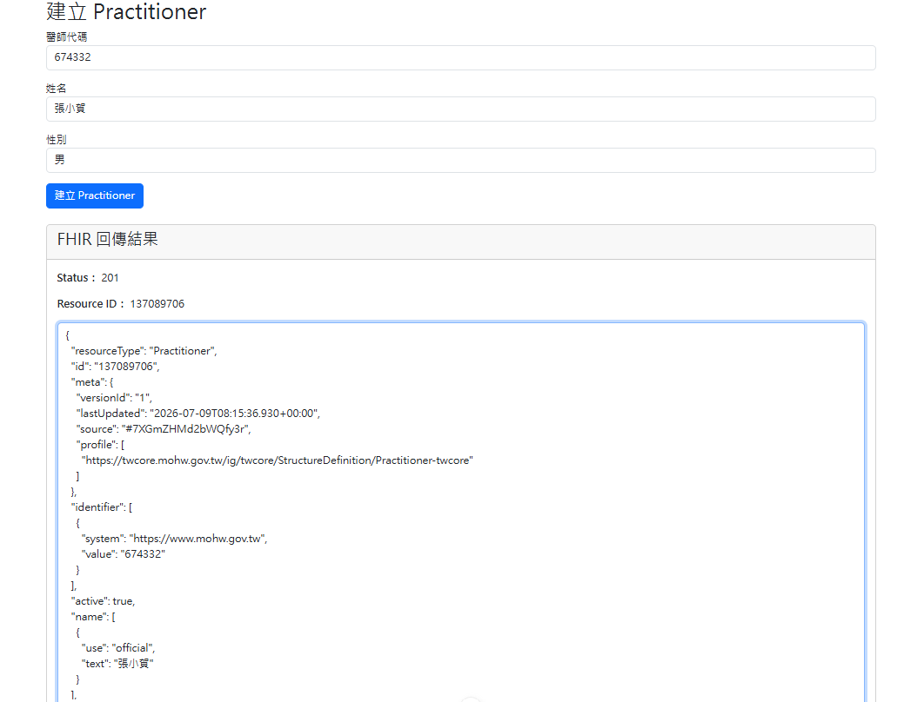
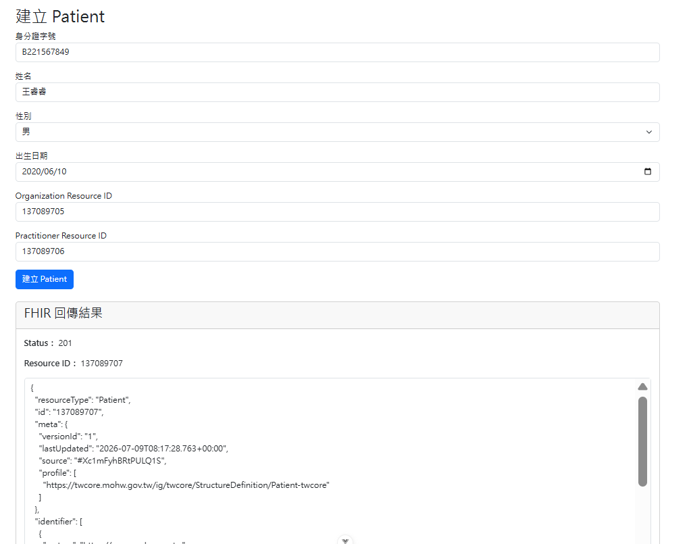
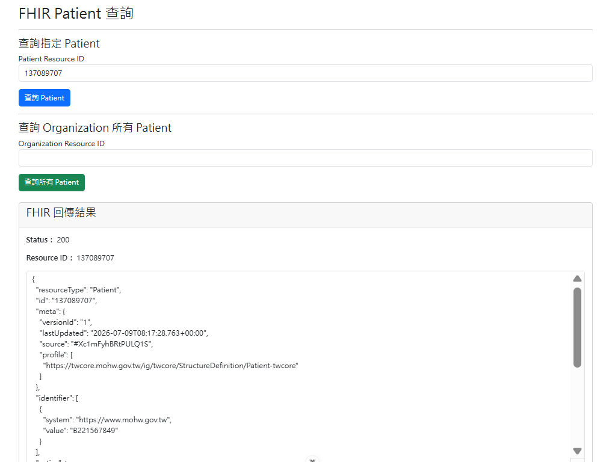
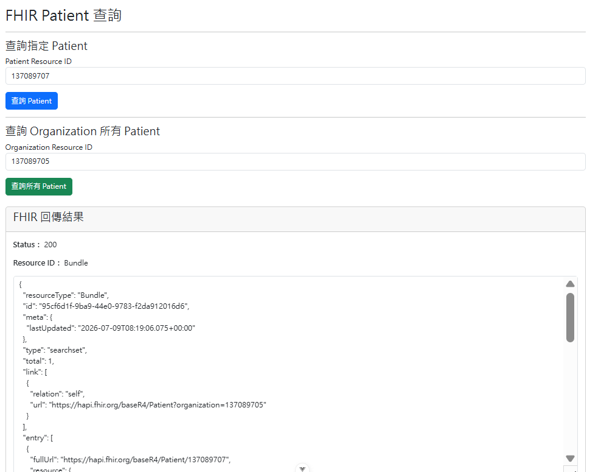

# FHIR Exchange Platform

A healthcare interoperability platform built with Vue 3, Express and HAPI FHIR Server following HL7 FHIR R4 and TW Core IG specifications.

---

## Project Overview

This project simulates healthcare information exchange workflows using the HL7 FHIR R4 standard and Taiwan Core Implementation Guide (TW Core IG).

The system provides a web interface for creating and querying healthcare resources and demonstrates interoperability between healthcare systems.

---

## Features

### Resource Creation

- Create Organization Resource
- Create Practitioner Resource
- Create Patient Resource

### Resource Query

- Query Patient by Resource ID
- Query all Patients under Organization

### Validation

- TW Core IG Profile Validation
- FHIR JSON Visualization
- OperationOutcome Handling

### Healthcare Interoperability

- HL7 FHIR R4
- RESTful API
- HAPI FHIR Server Integration

---

## Technology Stack

### Frontend

- Vue 3
- JavaScript
- Composition API
- Axios
- Bootstrap

### Backend

- Node.js
- Express.js
- RESTful API

### Healthcare Standards

- HL7 FHIR R4
- TW Core IG
- HAPI FHIR Server

### Development Tools

- Git
- GitHub
- Postman
- VS Code

---

## System Architecture

```text
┌──────────────────┐
│   Vue Frontend   │
└────────┬─────────┘
         │ REST API
         ▼
┌──────────────────┐
│ Express Backend  │
└────────┬─────────┘
         │ FHIR REST API
         ▼
┌──────────────────┐
│ HAPI FHIR Server │
└──────────────────┘
``` 
---

## Project Structure
```text
fhir-exchange-platform
│
├── client
│   ├── src
│   │   ├── builders
│   │   ├── services
│   │   ├── views
│   │   └── components
│
├── server
│   ├── routes
│   ├── services
│   └── utils
│
├── screenshots
└── README.md
```
---

## FHIR Resource Relationship
```text
Organization
     │
     └── manages
            │
            ▼
        Patient
            │
            └── generalPractitioner
                    │
                    ▼
               Practitioner
```
---

## API List
```text
Organization API
| Method | Endpoint              | Description         |
| ------ | --------------------- | ------------------- |
| POST   | /api/organization     | Create Organization |
| GET    | /api/organization/:id | Get Organization    |

Practitioner API
| Method | Endpoint              | Description         |
| ------ | --------------------- | ------------------- |
| POST   | /api/practitioner     | Create Practitioner |
| GET    | /api/practitioner/:id | Get Practitioner    |

Patient API
| Method | Endpoint                      | Description                  |
| ------ | ----------------------------- | ---------------------------- |
| POST   | /api/patient                  | Create Patient               |
| GET    | /api/patient/:id              | Get Patient                  |
| GET    | /api/patient/organization/:id | Get Patients by Organization |
```
---

## screenshots

### Organization Creation


### Practitioner Creation



### Patient Creation



### Patient Query by ID



### Patient Query by organization



---

## Author

Pei-Yu Hsu

FHIR Engineer | Healthcare Software Engineer | Medical Informatics Engineer

GitHub:
https://github.com/queen987655